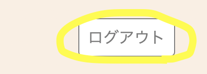

  
# はじめに
これから紹介する"MY BUCKET LIST"は簡単にバケットリストの作成＆管理ができるアプリケーションです。  
バケットリストとは、人生で死ぬまでにやりたいことを書き出したリストのことで、欧米では映画のタイトルになるくらい馴染みのある言葉のようです。  
近年はコロナの流行も影響し、”やりたいことがたくさんあるのになかなかできない"といった人が私の周りに多くいました。  
そのような中で、"自分のやりたいことを整理しながら楽しく人生設計ができるアプリがあればいいな"と思い、バケットリストアプリの開発を決めました。  
開発にあたり心掛けたことは、ただのリスト管理アプリにするのではなく、目標達成のためにモチベーションを維持してくれるような楽しいアプリにするということです。  
ユーザー間でコミュニケーションができるような機能いくつか盛り込むことで、上記を実現し意図したアプリに近づけることができました。  

# 開発環境
macOS 12.1  
Ruby 2.7.3  
Ruby on Rails  6.1.6.1  
MySQL 5.7.39  
Docker 20.10.14  
Bootstrap 5.0  
Rspec  
Visual Studio Code  
## デプロイ方法
AWS

# MY BUCKET LISTの機能紹介

　
## 1."BUCKET LIST"

本アプリでログインまたは新規登録をすると、"BUCKET LIST"のページに遷移します。  
ここでは自分のリストを作成・編集したり、みんなの公開リストを見ることができます。
  
画面左上に"ユーザー名のリスト"と"みんなのリスト"の２つのタブがありますが、デフォルトでは自分のリストのタブが表示されています。

### 1.1 BUCKET LIST の作成
早速、自分のリストを作成してみましょう。
右上にある"新規"ボタンを押すとリストの新規作成画面に遷移します。
必要項目を埋めていきましょう。
  
**他のユーザーに見られたくない場合は、公開設定の欄で"非公開"を選択してください。**

必要項目を全て埋めたら"作成"ボタンを押して、保存しましょう。  

### 1.2 自分のBUCKET LIST一覧

リスト作成後、自分のBUCKET LIST 一覧ページに遷移します。  
この画面で先ほど作成したリストを確認することができます。
 

### 1.3 BUCKET LIST の編集
自分が作成したリストは、右下の編集アイコンをクリックすることで内容を編集することができます。
 
 

### 1.4 BUCKET LIST の削除
右下のゴミ箱アイコンをクリックすると、リストを削除することができます。  
 

### 1.5 みんなのBUCKET LIST 一覧
メニュータブの"みんなのリスト"をクリックすると、設定が"公開"になっている全てのリストを見ることができます。
他のユーザーのリストを参考にして、自分のリストを充実させましょう。

 

## 2."達成ルーム"
達成ルームでは、達成したリストの記録を見ることができます。

### 2.1 達成レポの作成

自分のリストを達成したら、リストにある達成ボタンを押しましょう。
達成レポートを作成する画面に遷移します。  
 

 

記念写真は任意ですが、登録することでより良い達成レポが作成できます。  

**リスト作成時と同様、他のユーザーに見られたくない場合は、公開設定の欄で"非公開"を選択してください。**

必要項目を埋めて"投稿する"ボタンを押すと達成レポが作成されます。

### 2.2 達成レポの表示
リスト作成後、達成ルームの"みんなの記録"ページに遷移します。  
この画面で先ほど作成したリストを含め、設定が"公開"になっている全ての達成レポを見ることができます。  
みんなの達成レポを見て、モチベーションを高めましょう。  

 

メニュータブの自分(ログインユーザー名)の記録をクリックすると、公開・非公開関係なく、自分か過去に作成したレポートのみを見ることができます。

### 2.3 おめでとう機能

それぞれ達成レポにはおめでとうボタンがついています。
このおめでとうボタンを押すことで、達成ユーザーに祝福の気持ちを伝えることができます。  
 

## 3."アドバイス広場"
ここではQ&A形式で、目標達成に向けて必要な情報を収集することができます。  
 

### 3.1 質問一覧
ヘッダーの"アドバイス広場"をクリックすると、質問一覧画面に遷移します。
ここではユーザーが投稿した質問のタイトルを一覧で見ることができます。

 

### 3.2 新規質問作成
早速"質問する”のボタンを押して質問を作成してみましょう。
 

必要な項目を埋めて"投稿"ボタンを押すと新規質問が作成されます。
質問一覧でリストが作成されているか確認してみましょう。

### 3.3 アドバイスをする
質問一覧ページで気になる質問クリックすると、クリックした質問の詳細ページに遷移します。

 

質問に対してアドバイスができそうなときは、ぜひアドバイスを投稿してあげましょう。  
テキストボックスにアドバイスを打ち込んで、ボタンを押すと投稿されます。

たくさんアドバイスをして、他のユーザーの目標達成に貢献しましょう。
自分が投稿したアドバイスは、ゴミ箱アイコンをクリックすると削除できます。 

## 4. "ユーザー画面"

### 4.1 ユーザー情報確認
ヘッダーにある自分のユーザー名をクリックすると、ユーザー情報画面に遷移します。  

ここでは自分の基本情報やリストの数などを確認することができます。  

### 4.2　プロフィール写真を登録する
"プロフィール写真変更"をクリックするとプロフィール写真編集画面に遷移します。  

ぜひ自分のプロフィール写真を登録しましょう。   
登録したユーザー写真は、"みんなのリスト"や"アドバイス広場"で自分のアイコンとして表示されます。

### ４.3 ログアウトする
ユーザー画面の右上"ログアウト"ボタンを押すとログアウトできます。
ログアウト後はTOP画面に遷移します。

# モデル一覧

# こだわり
 
本アプリ開発でこだわったポイントは、リストをカテゴリーごとに色分けして表示させるようにした点です。  
この表示方法によってリスト一覧の見やすさが大幅に向上し、なおかつ"楽しさ"を表現したアイコニックなアプリに仕上がりました。
このカテゴリーの表示方法はアドバイス広場の質問欄でも採用しており、アプリの統一感を高めています。

# 今後の開発計画
1. バケットリストの並べ替え機能追加（ex:カテゴリー順、新着順）
2. 質問一覧の並べ替え機能追加（ex:カテゴリー順、新着順）
3. バケットリストのキーワード検索機能
4. 通知機能の追加(ex:達成レポが投稿通知、新着の質問やアドバイスの通知)  
etc...

